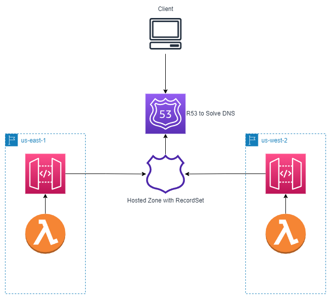

# Multi-Region AWS Infrastructure (Cloudformation)

The objective of this repo is to have an example of how one can deploy multi-region architecture using cloudformation and serverless framework (sls).

We will use `us-east-1` as our main region, and have a **failover** endpoint in `us-west-2`.

We will deploy the following baseline architecture. From there you can use ECS,EC2, or other integration with your API.


Which will be composed of:
- 2 Regions, in each region there will be:
  - 1 **Public** API Gateway with an accessible endpoint.
  - 1 Lambda API Integration.

- There will be one healthcheck for our main region, us-east-1.

We will access the regions using a friendly DNS.

## Pre-Requisites:
A domain name is necessary, since I already own a domain I won't be showing how to create one but there are many tutorials out there on how to do this. It's usually done through the AWS console (if you use R53) or through your favorite Domain Name Registrar.

We will be doing this with mostly CloudFormation, we'll only use SLS for the deploying of the lambdas. However, the deploy of the baseline infrastructure will be done with `sls`, so install it if you haven't.

VPCs are optional for this particular tutorial, but you can create them too in the same cloudformation file if you'd like and attach them later to your lambda or EC2.

## Step-by-Step guide

1. We'll deploy the Hosted Zone, code is contained in folder `hostedzone`, it's pretty straightforward because we're using a public hostedzone. The only required property is the name, which must be the same of your FQDN. This means that if you own www.example.com, then this property must be `www.example.com`. [More details in the documentation](https://docs.aws.amazon.com/AWSCloudFormation/latest/UserGuide/aws-resource-route53-hostedzone.html#aws-resource-route53-hostedzone-properties).

2. Once we have a Hosted Zone we're ready to deploy the certificates, these certificates will be used later when we attach them to the API Gateways. For now, check the `certifs` folder. There's a caveat if your domain is not hosted in AWS or in your AWS account. If the domain is not hosted in Route 53, then the stack will remain in the `CREATE_IN_PROGRESS` state until you validate the certificate request.

   In my personal experience, it is better to issue the certificate in the console and perform the validations if your domain is not using R53 as registrar. 

3. APIs. We'll deploy a very basic hello API in each region, to be able to use these APIs from R53 we need to 'expose' them, we do this by using an API Mapping. Folder `api` has the definition.

4. API Mappings, as stated before, we expose the API by doing API Mappings, an API Mapping attaches an API with a Domain Name with a Certificate that's issued for a specific FDQN, now we need a way to access the API mapping easily and automatically. Check `api/mappings` folder.

5. RecordSet. This is the way amazon knows where to send the request that our domain receives, we will configure two  of these, one for each region, one will be our primary record set and the other will be a secondary fail-over record set that will point to our API Mapping in US-WEST-2. `route53` folder contains the scripts.

And that's pretty much it. The deploying of these resources should leave you with an accessible endpoint v1/ in your api through your domain, for example `domainname.com/v1`. Next step is to *hang* a lambda from V1. You can do that separately in another serverless file, using the resources output from `api/`. [I recommend you to read this sls guide on how to do exactly that](https://www.serverless.com/framework/docs/providers/aws/events/apigateway#easiest-and-cicd-friendly-example-of-using-shared-api-gateway-and-api-resources) 

## Deploy Order

1. Hosted Zone (Global)
2. Certificates (One per region)
3. API (One per region)
4. API Mappings (One per region)
5. Recordsets. (One per region, just for the template to use the appropiate parameters, but you can do this in one go.)

### Example:

```
cd hostedznone
sls deploy --stage dev --region us-east-1
cd certifs
sls deploy --stage dev --region us-east-1 
sls deploy --stage dev --region us-west-2
cd api 
sls deploy --stage dev --region us-east-1 
sls deploy --stage dev --region us-west-2
```
